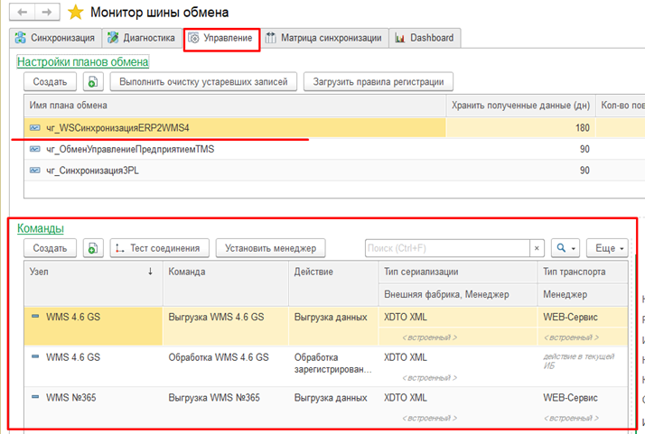

# Команды

Справочник команд служит для организации выполнения операций по получению, передаче, обработке данных. 
 

 
Настройка автоматического выполнениЯ (создание регламентного заданиЯ) команды производится на вкладке Управление заданием расписания и записью элемента. 
Пиктограммы отвечает за запуск/остановку автоматического выполнения (использование/неиспользование регламентного заданиЯ). 
ДлЯ удаления регламентного задания необходимо пометить на удаление команду.
Ограничения служат для указания обрабатываемых этой командой метаданных. Отсутствие ограничений означает обработку всех метаданных. 

Ручное выполнение команд обслуживания при необходимости осуществляется из Монитора обслуживания или из объектов информационной базы, участвующих в синхронизации, через команды навигационной панели.

