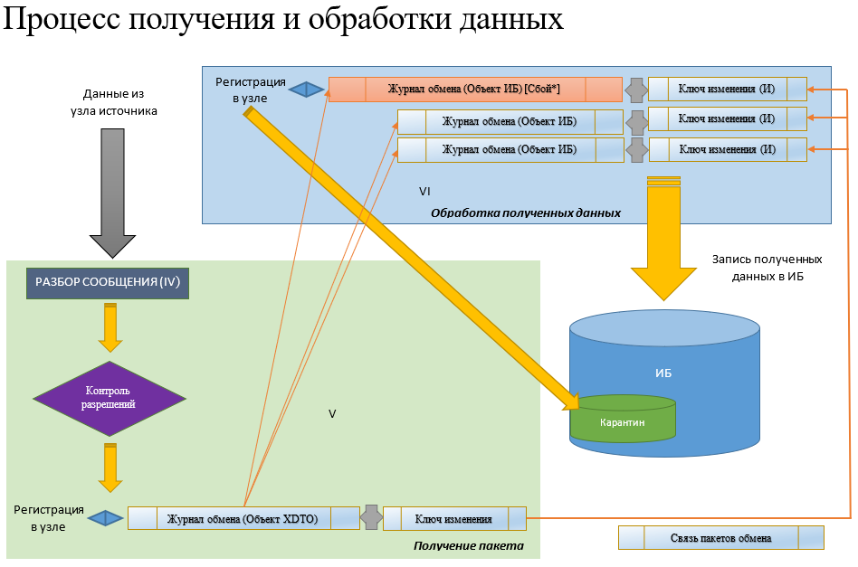
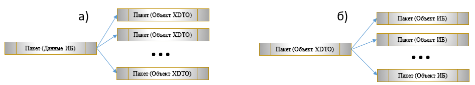

# Џодсистема обслуживания данных

## ѓлоссарий

**†урнал операций** - список всех выгруженных, загруженных и обработанных данных. Един для всех узлов и планов обмена.
**Џакет обмена** - элемент справочника с хранилищем сериализованных данных. Тип пакета обмена определяет его содержимое. Наименование пакета – контрольная сумма его данных.	
**Љлюч пакета обмена** - ключевые поля содержимого объекта. Для Данных ИБ – Идентификатор (или измерения для регистров) + Тип, для Объекта XDTO – поля объекта наследника **Ref**, для Объекта ИБ – Идентификатор (или измерения для регистров) + Тип.
**€дентификатор пакета обмена** - контрольная сумма ключа пакета обмена.
**Ѓазовый идентификатор** - идентификатор пакета-источника изменений, используется только в журнале обмена текущей информационной базы. Возможное преобразование пакетов: а) – при выгрузке, б) – при загрузке.

**Љлюч изменениЯ** - элемент справочника, служащий для связки журнала обмена и данных о пакете обмена. Ключи изменения связаны через РС ***Связи пакетов обмена***. Эта связь образуется при обработке пакета-источника см. изображения выше.
**‘ообщение обмена** - единица обмена между базами. Является набором сериализованных данных, разложенных по именам типов. 
**Њонитор шины обмена** - одно кольцо, чтоб править всеми.

## Ћбработка Њонитор ЋбслуживаниЯ

## Њониторинг

Њониторинг осуществляется посредством передачи данных на платформу визуализации Grafana через HTTP-сервис DashBoard. Адрес для доступа для источника данных имеет шаблон http://<С‘ервер>/<ИмяПубликации>/hs/grafana/<ИмяПланаОбмена>/<КодУзла>. 
по данному URL доступны метрики, полученные из всех команд узла шины обмена.  Для выполнения мониторинга производительности ключевых операций шины обмена необходимо: 
1.	Задать список метрик в команде узла.								  
2.	Обеспечить фиксацию данных о производительности в менеджере команды.
КЉроме метрик операций команды в систему мониторинга предоставляются данные: 
 - информация по событиям журнала операций (метрика Log) 
 - информация по заполнению карантина (метрики **SendingIsolation** и **ReceivingIsolation**)
 - метрики команд (информация о последней дате выполнения регламентного задания команды и время выполнения команды (метрика с добавлением префикса ***<ИмяПланаОбмена.КодУзла.>***)). 
Адрес до страницы визуализации Grafana указывается в реквизите DashBoardURL узла шины обмена.

