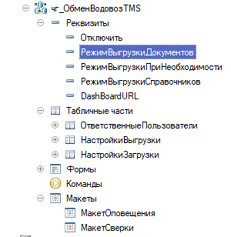
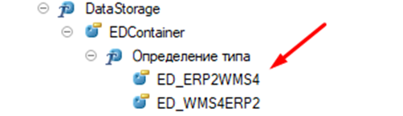

# Порядок интеграции подсистемы в конфигурацию

1.	Сравнение-объединение по подсистеме «БазоваяФункциональность». Убедиться, что подсистема верхнего уровня захвачена или отсутствует.
2.	Создать новый план обмена с минимальным набором реквизитов: Отключить, РежимВыгрузкиДокументов, РежимВыгрузкиПриНеобходимости, РежимВыгрузкиСправочников, DashBoardURL, табличных частей: ОтветственныеПользователи, НастройкиВыгрузки, НастройкиЗагрузки, макетов: МакетОповещения, МакетСверки. Отредактировать состав, авто регистрация запрещена (обязательно добавить регистр сведений ЖурналОпераций).

3.	Отредактировать определяемые типы: СинхронизируемыеОбъекты, УзлыШиныОбменаМА								   
4.	Добавить обработки сериализации/десериализации 

- создание обработки сериализации XDTO

- создание обработки десериализации XDTO

- создание обработки произвольной сериализации

- создание обработки произвольной десериализации

5.	Добавить Модели XDTO. Добавить в каждую модель объект-коллекцию XDTO для всех возможных выгружаемых типов данных. Выгружаемые объекты XDTO должны наследоваться от типа Object, их ключи от типа Ref из Модели XDTO MABusExchangeCommon.
6.	Внести изменения в Модель XDTO MABusExchangeMessage, добавив объекты-коллекции XDTO из каждой добавленной в п.5 модели в контейнер.

 
7.	Изменить функции модуля менеджера Плана Обмена: ИмяТаблицыПланаОбмена, ПолучитьМенеджерОбработчикаОтправки, ПолучитьМенеджерОбработчикаПолучения, ПространствоИменВыгрузки, ПространствоИменЗагрузки, КоллекцииXDTO_Выгрузка, КоллекцииXDTO_Загрузка в соответствии с добавленными в п. 4, 5 метаданными. При необходимости изменить процедуры формирования макетов для оповещения, сверки.
8.	Добавить подписки на события Объектов, указанных в составе плана обмена, за исключением регистров сведений ЖурналОпераций и СоответствияОбъектовИнформационныхБаз.
9.	Добавить в расширение «ИнтеграционныеМодулиШиныОбменаМА» объекты состава узла. В их модулях менеджера описать функции получения данных для сериализации. Обязательные данные ИБ для ссылочных типов: Ссылка, Представление, ИмяПредопределенныхДанных (для идентификации по ПКЗ).
10.	Внести изменения в функцию получения расшифровки ПолучитьОписаниеПредставленияОбъектаXDTO модуля ШинаОбменаМАПовтИсп, в функцию получения данных ПолучитьДанныеИБ_Расширяемый, для нестандартных команд в функцию ВыполнитьКомандуШиныОбменаМА_Расширяемый модуля ШинаОбменаМАПереопределяемый.
11.	Отредактировать роль чг_БазовыеПраваШиныОбменаМА.
12.	Создать правила регистрации

