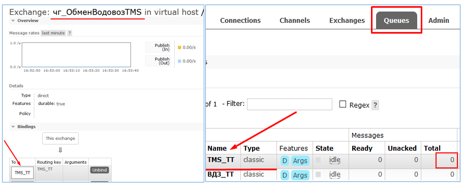
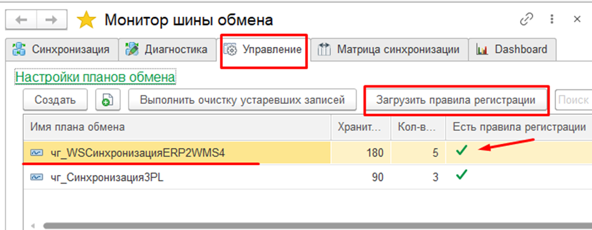

# Порядок действий при обновлении подсистемы подсистемы

 Представленные порЯдок обновления подсистемы необходим для исключения ситуаций, когда сообщение старого формата будет обрабатываться (а скорее всего оно попадет в Карантин, несмотря на то, что будет верным для старых алгоритмов) новыми обновленными алгоритмами. Наиболее полный порЯдок действий при обновлении (ряд действий может опускаться в простых случаЯх обмена или при обновлениях, не затрагивающих основные механизмы и формат обмена между базами):

1.	Остановить регламентные задания команд всех обновляемых баз, участвующих в обмене.
2.	УбедитьсЯ в отсутствии зарегистрированных данных к выгрузке.
3.	Выполнить команды выгрузки для всех не отключенных узлов всех планов обмена. Проверить отсутствие зарегистрированных данных к выгрузке.
4.	При необходимости проверить/извлечь/исправить/выгрузить данные Карантина выгрузки.
5.	Для узлов, имеющих команды транспортировки с промежуточным хранением (FTP, FILE, AMQP), выполнить команды загрузки. Убедиться, что все сообщения из хранилища получены:	
  	   - для файловых хранилищ в отсутствии файлов по указанному пути с именами, согласно заданному шаблону.
      - для брокера AMQP в отсутствии сообщений в очереди (имЯ очереди идентично коду узла) длЯ этого узла. 

  

6.	Установить настройку "Количество повторов обработки пакета" в значение 1.
7.	При необходимости проверить/извлечь/исправить/обработать данные Љарантина ‡агрузки.
8.	Выполнить команды обработки данных для всех не отключенных узлов всех планов обмен. 
9.	Убедиться в отсутствии зарегистрированных пакетов к обработке. 
 

10.	Вернуть прежнее значение настройки "Количество повторов обработки пакета". 
11.	Обновить расширение  для соответствующей конфигурации
12.	Выполнить обновление конфигурации.
13.	При необходимости очистить внешние менеджеры у команд.
14.	Обновить правила регистрации для каждого плана обмена при необходимости

