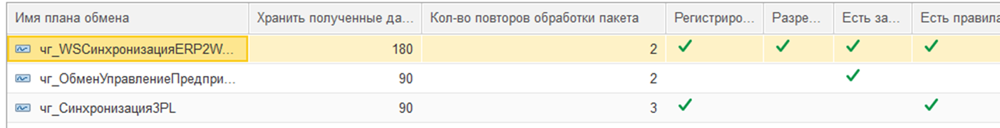
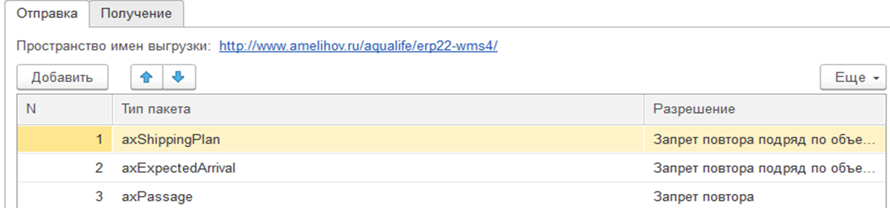
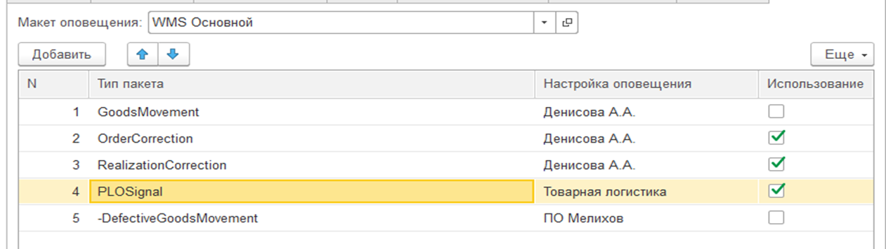

# Узлы плана обмена

Узлы планов обмена служат для обособления команд и их операций. Узлы используют ряд общих настроек, введённых для плана обмена. 
С помощью детальных настроек узла описываются параметры регистрации объекта в узел, разрешенные разработчиком, правила передачи и получения операций, оповещение ответственных за нарушения при обработке данных (см. подсистема расширенных настроек). 
В рамках узла создаются команды и их настройки подключения к удаленной системе.
 

 
 
Правила передачи и получения данных для выполнения задаются для каждой операции с помощью разрешения и правила проверки данных. Разрешения могут иметь следующие значения:
- **Запрет**. Данная операция не обрабатывается этим узлом. В журнале операции не делается запись.
- **Запрет повтора**. Запрещает обработку ранее полученного пакета. В журнал операции записывается информация о некорректной операции.
- **Запрет повтора подряд по объекту ИБ**. Запрещает обработку, при получении данных подряд. В журнал операции записывается информация о некорректной операции.
- **Полное разрешение**. Никаких ограничений.
- **Однократно по объекту ИБ**. 

