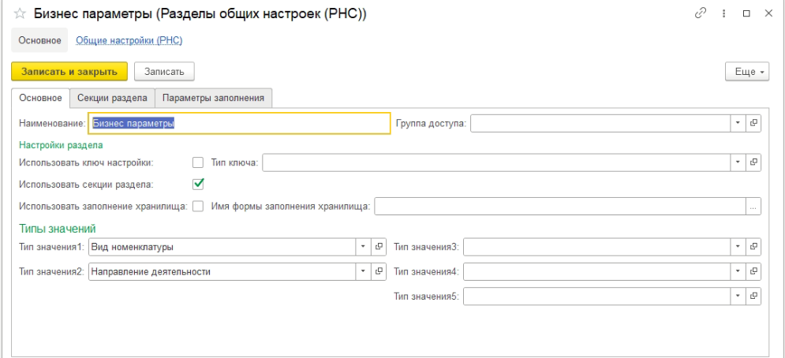
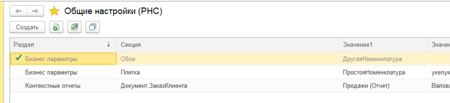

# Общие настойки

Общие настроки состоят:
1. Справочник "Разделы общих настроек"
2. Регистр сведений "Общие настроек"
3. ПВХ "Типы значений расширенных настроек"

## Разделы настроек

Справочник служит для определения типов необходимых настроек и разрезов из хранения. 
На форме выбираются типы значений настроек, настраивается использование разрезов:
- Секция. Добавляются в соответствующие табличной части
- Ключ. Настраиваются поля ключа.

При необходимости можно указать форму для заполнения хранилища записи.
  

  
## Список общих настроек

Хранит значения (пять значений и хранилище.) в разрезе раздела, секции и ключа. 
Есть возможность отключить настройку. 
Модуль менеджера содержит функцию для получения текста запроса данных по разделу "ЗапросОбщиеНастройки".

 

 
 

## Типы значений настроек

Кроме типа содержит __*"Заголовок"*__ настройки.

 
