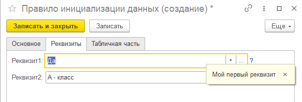
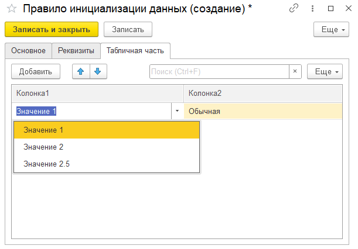

# Правила инициализации

1. Справочник "Правила инициализации данных"
2. Справочник "Шаблон набора параметров"

## Правила инициализации данных

Служит для хранения значений и табличных частей в хранилищах значений. Предлагает заполнять структуру данных согласно выбранному шаблону. Модуль менеджера содержит функцию для получения данных "ВыполнитьПравило".

Заполнение реквизитов шапки.                                              

Заполнение табличной части. Колонка с выбором из списка.

## Шаблон набора параметров

Хранит структуру реквизитов и табличных частей.

Создание шаблона. Форма редактированиятипа реквизита.

