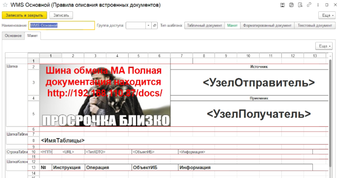

# Правила описание встроенных документов

Служит для изменения, хранения встроенных документов: табличного документ, макета табличного документа, текстового документа, форматированного документа. Модуль менеджера содержит функцию для получения данных "ВыполнитьПравило"
  

  

