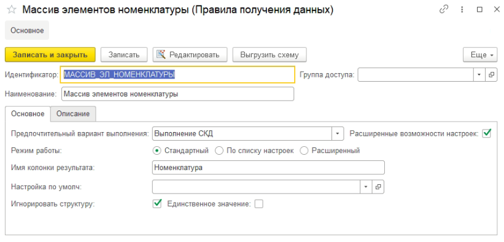
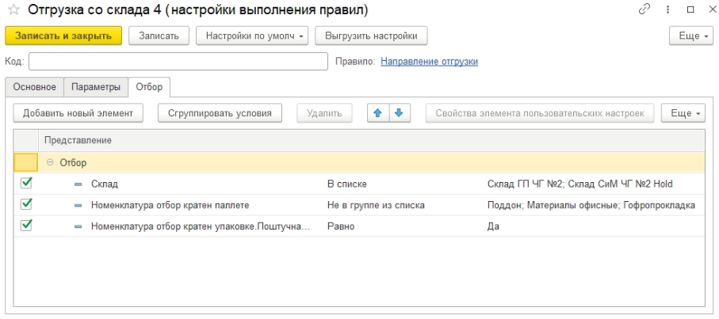
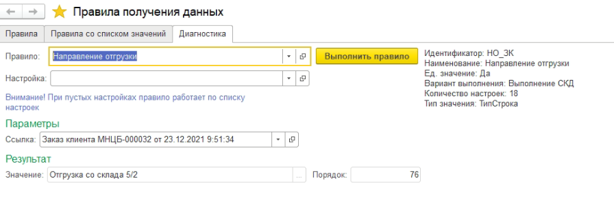

# Правила получения данных

1. Справочник "ППД"
2. Справочник "Настроеки ППД"
3. Регистр сведений "Настройки получения значений"

## Описание Правила

Справочник служит для хранения и редактирования схемы компоновки данных. Модуль менеджера содержит функцию для получения данных "ВыполнитьПравило".
- __*Вариант выполнения*__  правила служит для определения способа получения данных: 
	+ *выполнение схемы* (простое выполнение СКД с настройкой)
	+ *выполнение запроса* (выполнение запроса, полученного при сохранении настройки) возможно только при простой схеме(один набор данных, нет расчетных полей в схеме и в настройке). 

- __*Режим работы*__ указывает, где находятся настройки и какие данные будут возвращены:
	+ *Стандартный вариант*. Настройка указывается при выполнении правила, возвращаются данные, полученные схемой.
	+ *По списку настроек*. Настройки задаются в регистре «Настройки получения значений», возвращается значение, указанное из колонки «результат», если при выполнении правила с 		текущей настройкой получена хотя бы одна строка. **При варианте выполнения запросом никакого поштучного выполнения не будет! Будет выполнен один единый запрос, состоящий из 		запросов действующих настроек**.
	- ~~*Расширенный*. Происходит выполнение указанных правил и агрегация результата.~~

- __*Номер фиксированного запроса в пакете*__ указывает индекс крайнего запроса в пакете. До этого этого индекса все запросы считаются независящями от отборов.
- __*Используется список объектов*__ определяет для варианта выполнения *выполнение запроса* использование списка значений.
- __*Тип свойства*__ используется при режиме работы *По списку настроек*. Определяет тип значения в регистре настроек.
- __*Игнорировать структуру*__ служит для очистки структуры схемы при выполнении и добавления «детальных записей». 

Тип результат определяется реквизитами __*Имя колонки*__, __*Единственное значение*__: 

+ __*Имя колонки*__ *не задано*:
	- Флаг __*Единственное значение*__ *установлен* – структура из строки таблицы-результата
	- Флаг __*Единственное значение*__ *сброшен* – таблица значений
+ __*Имя колонки*__ *задано*:
	- Флаг __*Единственное значение*__ *установлен* – одно значение
	- Флаг __*Единственное значение*__ *сброшен* – массив 
  

  
## Описание Настройки правила

Справочник хранит настройки схемы компоновки данных и, если вариант выполнения запрос, то текст запроса и его параметры.

 

## Тестирование правила

Тестирование осуществляется в форме списка правил на вкладке «Диагностика»

 
